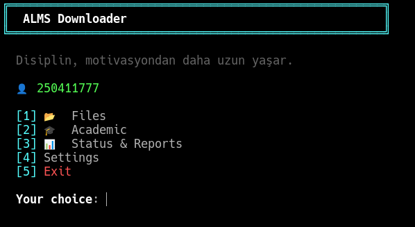
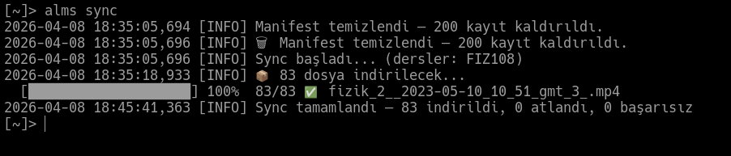

> 🇹🇷 [Türkçe](https://github.com/trs-1342/alms/blob/main/KULLANIM.md) &nbsp;|&nbsp; 🇬🇧 **English**

---

# ALMS Downloader — Usage Guide

---

## Quick Start

```bash
alms setup             # First-time setup (done once)
alms                   # Open menu
alms sync              # Download new files
alms obis --sinav      # View exam schedule
alms cache --guncelle  # Save OBIS data for offline use
```

---

## All Commands

### `alms` — Menu
```
alms
```
Opens the interactive menu. All features are accessible from here.

<!-- ═══════════════════════════════════════════════════════════════
     PHOTO 1 — Main menu screenshot
     Where to capture : run  alms  in terminal (no arguments)
     File             : assets/foto-1-en.png
     ═══════════════════════════════════════════════════════════════ -->


```
[1] Files
    ├── Sync New Files
    ├── Download Files (picker)
    ├── List Courses
    ├── Today's Schedule / Calendar
    ├── Open Download Folder
    └── Export

[2] Academic
    ├── Exam Schedule
    ├── Grades
    ├── Transcript & GPA
    ├── Course Schedule
    ├── Attendance
    ├── Announcements
    ├── LMS Timeline
    ├── Exam Topics
    └── Offline Cache

[3] Status & Reports
[4] Settings
    ├── Settings
    ├── Auto Run
    └── Notification Automation
[5] Exit
```

---

### `alms setup` — Setup
```
alms setup
alms setup --reconfigure credentials   # Update credentials only
alms setup --reconfigure schedule      # Update automation schedule only
```
Configures username, password, and settings on first run.
Re-running shows reconfiguration options.

---

### `alms sync` — Sync

<!-- ═══════════════════════════════════════════════════════════════
     PHOTO 2 — Sync progress bar screenshot
     Where to capture : while  alms sync  is running (████░░ bar visible)
     File             : assets/foto-2-en.png
     ═══════════════════════════════════════════════════════════════ -->


```
alms sync                              # Download new files
alms sync --course FIZ108              # Single course
alms sync --courses FIZ108,MAT106      # Multiple courses
alms sync -f pdf                       # PDFs only
alms sync -f video                     # Videos only
alms sync --week 7                     # Week 7 only
alms sync --all                        # Re-download everything
alms sync --force                      # Same as --all
alms sync --quiet                      # Silent mode (for cron/scheduler)
alms sync -v                           # Verbose logs
```

**Filters can be combined:**
```bash
alms sync --course FIZ108 -f pdf --week 3
```

---

### `alms download` — File Picker
```
alms download
```
Opens the interactive file selection screen.

**Keyboard Shortcuts:**

| Key | Action |
|-----|--------|
| `↑` `↓` | Navigate |
| `SPACE` | Select / deselect |
| `G` | Select entire group |
| `A` | Select all |
| `N` | Clear selection |
| `F` | Filter (course code or filename) |
| `ESC` | Clear filter |
| `ENTER` | Confirm and download |
| `Q` | Cancel |

**File indicators:**

| Symbol | Meaning |
|--------|---------|
| `●` | Selected |
| `◉` | Already downloaded |
| `○` | Not selected |

---

### `alms list` — Course List
```
alms list
```
Shows enrolled courses and progress percentages.

---

### `alms today` — Daily Schedule
```
alms today
```
Shows today's and upcoming activities (assignments, exams).

---

### `alms status` — System Status
```
alms status
```
Displays:
- App version and build
- Whether an update is available
- ALMS token status (minutes remaining)
- Download folder and file count
- Automation schedule
- Network connectivity
- OBIS session status

---

### `alms open` — Open Folder
```
alms open
```
Opens the download folder in the system file manager.

---

### `alms stats` — Statistics
```
alms stats
```
Shows number of downloaded files and size per course.

---

### `alms log` — Activity Log
```
alms log
```
Shows the last 30 sync/download records.

---

### `alms export` — Export
```
alms export
```
Exports the course list, downloaded file index, **and OBIS academic data**.
Format: Markdown or JSON.
Output: `~/ALMS/alms_index_DATE.md` or `.json`

**What gets exported:**
- Course list and file index
- Exam schedule (if cached)
- Grades (if cached)
- Transcript (if cached)
- Attendance (if cached)
- Course schedule (if cached)

---

### `alms obis` — OBIS Integration

<!-- ═══════════════════════════════════════════════════════════════
     PHOTO 3 — Exam schedule screenshot
     Where to capture : alms obis --sinav output (date + time list)
     File             : assets/foto-3-en.png
     ═══════════════════════════════════════════════════════════════ -->


```
alms obis --setup              # Set up OBIS session (done once)
alms obis --setup --force      # Force session refresh
alms obis sinav                # Exam schedule (default)
alms obis notlar               # Course grades: assignments/midterm/final/letter
alms obis transkript           # Full transcript + semester GPA and cumulative GPA
alms obis program              # Weekly course schedule
alms obis devamsizlik          # Attendance (red warning when near limit)
alms obis duyurular            # OBIS announcements (full content)
alms takvim                    # ALMS activity timeline (assignments, exams)
alms duyurular                 # Shortcut: announcements screen
alms transkript                # Shortcut: transcript screen
alms program                   # Shortcut: course schedule screen
alms devamsizlik               # Shortcut: attendance screen
alms notlar                    # Shortcut: grades screen
alms sinav                     # Shortcut: exam schedule screen
```

**OBIS setup:**
1. Log into `obis.gelisim.edu.tr` in your browser
2. `F12` → `Storage` → `Cookies` → `obis.gelisim.edu.tr`
3. Copy the `ASP.NET_SessionId` value
4. Run `alms obis --setup` and paste it

Any of these token formats are accepted:
```
m1qijfitlaoatp0mddt2bmtd
ASP.NET_SessionId:"m1qijfitlaoatp0mddt2bmtd"
ASP.NET_SessionId=m1qijfitlaoatp0mddt2bmtd
```

Example exam schedule output:
```
📅  April 18, 2026  ← 17 days away
──────────────────────────────────────────────────────────────────────
  YZM102     BASIC PROGRAMMING II          MIDTERM  11:00

📅  April 20, 2026  ← 19 days away
──────────────────────────────────────────────────────────────────────
  MAT106     MATHEMATICS II                MIDTERM  17:00
```

---

### `alms cache` — Offline Cache

<!-- ═══════════════════════════════════════════════════════════════
     PHOTO 5 — Cache status screen
     Where to capture : alms cache  (some fresh, some stale entries)
     File             : assets/foto-5-en.png
     ═══════════════════════════════════════════════════════════════ -->


Save OBIS data locally and view it without an internet connection.

```
alms cache                   # Show cache status
alms cache --guncelle        # Fetch and cache all OBIS data
alms cache --temizle         # Clear the cache
```

**What gets cached:**
- Exam schedule
- Course grades (assignments / midterm / final / letter)
- Transcript & GPA
- Weekly course schedule
- Attendance status
- Announcements

**Usage scenario — exam day:**
```bash
# The night before (while connected):
alms cache --guncelle

# Exam morning (no internet):
alms obis sinav        # ⚠  Showing cached data — 2026-04-07 23:41
alms obis devamsizlik  # ⚠  Showing cached data
```

> When connected, OBIS screens automatically update the cache on each visit.
> Cache files: `~/.config/alms/cache/` (Linux/macOS) or `%APPDATA%\alms\cache\` (Windows)

**Status output example:**
```
  Offline Cache Status

  Exam Schedule       fresh      2026-04-07 23:41  (8h ago)
  Grades              fresh      2026-04-07 23:41  (8h ago)
  Transcript          stale      2026-04-06 14:22  (33h ago)
  Course Schedule     fresh      2026-04-07 23:41  (8h ago)
  Attendance          fresh      2026-04-07 23:41  (8h ago)
  Announcements       —          none
```

---

### `alms konular` — Exam Topics

<!-- ═══════════════════════════════════════════════════════════════
     PHOTO 4 — Exam topics list
     Where to capture : alms konular  (with a few topics entered)
     File             : assets/foto-4-en.png
     ═══════════════════════════════════════════════════════════════ -->


Community-shared exam topics via Firebase. No extra setup needed — Firebase connects automatically once `alms setup` is done.

```
alms konular                    # List all topics
alms konular --ekle             # Add a new topic
alms konular --vize             # Midterm topics only
alms konular --final            # Final topics only
alms konular --ders FIZ108      # Topics for a specific course
alms konular --oyla <id>        # Vote on a topic
alms konular --setup            # Configure Firebase (developer only)
```

**Example topic list output:**
```
  ── Exam Topics ──

  [1] FIZ108  MIDTERM  •  Weeks 1-4 topics
      • Kinematics and dynamics
      • Newton's laws
      • Energy and work
      👍 12  👎 1   ★★★★☆ Reliable  —  ID: a3f2c1
      to vote: alms konular --oyla a3f2c1

  [2] MAT106  MIDTERM  •  Derivatives and integrals
      • Concept of limits
      • Derivative rules
      👍 8   👎 0   ★★★★★ Very Reliable  —  ID: b7e9d4
```

**Adding a new topic (`alms konular --ekle`):**
1. Select exam type: Midterm / Final / Quiz / Resit
2. Select faculty (from list or manual entry)
3. Select department
4. Enter class year and section
5. Enter course code and name
6. Enter topics (single message or list mode)
7. Preview is shown, confirm to submit

**Voting:**
- Each student can vote once per topic
- 👍 Correct — information is reliable / 👎 Incorrect — information is wrong
- Votes cannot be changed or withdrawn

**Trust Score:**
| Score | Meaning |
|-------|---------|
| ★★★★★ | Very Reliable |
| ★★★★☆ | Reliable |
| ★★★☆☆ | Moderate |
| ★★☆☆☆ | Questionable |
| ★☆☆☆☆ | Unreliable |

> **Privacy:** Student number is stored as SHA-256 hash. Real number is never visible on Firebase.
> **Spam protection:** Each student can add one topic per 30 minutes.

---

### `alms notify-check` — Notification Check

<!-- ═══════════════════════════════════════════════════════════════
     PHOTO 6 — Notification Automation settings screen
     Where to capture : alms  →  Settings  →  Notification Automation
     File             : assets/foto-6-en.png
     ═══════════════════════════════════════════════════════════════ -->


Sends a desktop notification when new OBIS announcements, exams, or exam topics are added.

```
alms notify-check           # Show status, notify if new items found
alms notify-check --quiet   # Silent check — sends notification only (for cron)
```

**Automatic scheduling — via menu:**

`alms` → **[4] Settings → Notification Automation**

- Enable → choose check interval (e.g. `1` hour)
- Disable → removes the schedule
- Reset Seen Items → clears seen records (all items will notify again on next check)

| Platform | Method | Log |
|----------|--------|-----|
| Linux | crontab (`0 */N * * *`) | `~/.config/alms/notify.log` |
| macOS | launchd | `~/Library/Application Support/alms/notify.log` |
| Windows | Task Scheduler | `%APPDATA%\alms\notify.log` |

**What it checks:**
- OBIS announcements (when connected)
- OBIS exam dates (when connected)
- Firebase exam topics (even without internet — independent of ALMS)

> Already-seen items are never re-notified. State is tracked in `~/.config/alms/notifier_state.json`.

---

### `alms update` — Update
```
alms update
```
Performs a safe update:
1. Backs up config files
2. `git pull origin main`
3. Updates dependencies
4. Saves version info
5. Refreshes automation schedule
6. Rolls back automatically on failure

---

### `alms --version` — Version Info
```
alms --version
```
Example output:
```
  ALMS Downloader v2.0.0 (build: ea4674a)
  Updated     : 2026-04-05
  Changes     : cross-platform fixes, auto-install
  Checking for updates...
  ✅ Up to date
```
If an update is available:
```
  ⬆️  3 updates available → v2.1.0 — run: alms update
```

---

### `alms logout` — Logout
```
alms logout
```
Securely deletes saved credentials and sessions.
Use when your ALMS password changes, then run `alms setup`.

---

### `alms config` — View Settings
```
alms config
```
Displays current settings in JSON format (sensitive values hidden).

---

## Automatic Downloads

Configure via menu **Settings → Auto Run**.

| Platform | Method | Log |
|----------|--------|-----|
| Linux | crontab | `~/.config/alms/cron.log` |
| macOS | launchd | `~/Library/Application Support/alms/cron.log` |
| Windows | Task Scheduler | `%APPDATA%\alms\cron.log` |

**Update check during automation:**
Every time the menu opens, updates are checked in the background.
If an update is available, you'll be prompted before the menu appears:
```
⬆️  3 updates available  v2.0.0 → v2.1.0
Update now? [Y/N]:
```

---

## File Structure

```
~/ALMS/                                      # Download folder
├── FIZ108/
│   ├── Hafta_01/
│   └── Hafta_07/
└── YZM102/

~/.config/alms/                              # Config (Linux)
~/Library/Application Support/alms/         # Config (macOS)
%APPDATA%\alms\                              # Config (Windows)
├── credentials.enc              # Encrypted credentials
├── config.json                  # Settings
├── manifest.json                # Download registry
├── version.json                 # Version info
├── obis_session                 # Encrypted OBIS token
├── alms.log                     # Application log
├── cron.log                     # Automation log
├── notify.log                   # Notification automation log
├── notifier_state.json          # Seen notification records
└── cache/                       # Offline cache
    ├── sinav.json
    ├── notlar.json
    ├── transkript.json
    ├── program.json
    ├── devamsizlik.json
    └── duyurular.json
```

---

## Security

| Feature | Status |
|---------|--------|
| Credential encryption | AES-256 (Fernet), machine-specific |
| OBIS token encryption | AES-256 (Fernet) |
| SSL verification | Always enabled |
| Log sanitization | Tokens/passwords never written to logs |
| Config permissions | `chmod 700` (directory), `chmod 600` (files) |
| Firebase privacy | Student number stored as SHA-256 hash, never in plain text |

---

## Troubleshooting

**`alms` command not found:**
```bash
# macOS (zsh)
source ~/.zprofile   # or open a new terminal

# Linux (bash)
source ~/.bashrc

# Linux (zsh)
source ~/.zshrc

# Windows
# Open a new CMD or PowerShell window
```

**macOS — `alms` runs but shows package errors (requests, cryptography):**
```bash
# The venv wrapper may be missing. Re-run setup:
./setup.sh
```

**macOS — lock file stuck after crash:**
```bash
rm ~/Library/Application\ Support/alms/.alms.lock 2>/dev/null
```

**OBIS session expired:**
```bash
alms obis --setup
```

**Token expired:**
```bash
alms logout
alms setup
```

**Update failed:**
```bash
# Manual update
cd /path/to/alms
git pull origin main
.venv/bin/python -m pip install -r requirements.txt
```

**Linux — missing dependency:**
```bash
.venv/bin/pip install -r requirements.txt
```

**Windows — missing dependency:**
```bat
.venv\Scripts\pip.exe install -r requirements.txt
```

**Cache corrupted or outdated:**
```bash
alms cache --temizle
alms cache --guncelle
```

**Exam topics not loading (Firebase connection issue):**
```bash
# Check network connectivity
alms status

# Check Firebase configuration
alms konular --setup
```

**Notification automation not working:**
```bash
# Test manually first
alms notify-check

# Re-configure the schedule
# alms  →  Settings  →  Notification Automation  →  Enable
```
