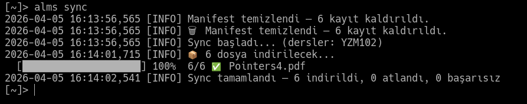
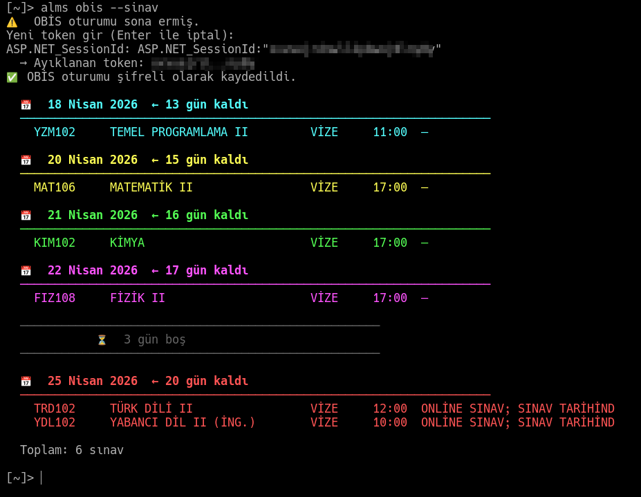

> 🇹🇷 **Türkçe** &nbsp;|&nbsp; 🇬🇧 [English](https://github.com/trs-1342/alms/blob/main/KULLANIM.en.md)

---

# ALMS İndirici — Kullanım Rehberi

---

## Hızlı Başlangıç

```bash
alms setup          # İlk kurulum (bir kez yapılır)
alms                # Menü aç
alms sync           # Yeni dosyaları indir
alms obis --sinav   # Sınav tarihlerini gör
```

---

## Tüm Komutlar

### `alms` — Menü
```
alms
```
İnteraktif menüyü açar. Tüm özellikler buradan erişilebilir.

---

### `alms setup` — Kurulum
```
alms setup
alms setup --reconfigure credentials   # Sadece şifre güncelle
alms setup --reconfigure schedule      # Sadece otomasyon saatini güncelle
```
İlk kurulumda kullanıcı adı, şifre ve ayarları yapılandırır.
Tekrar çalıştırıldığında yeniden yapılandırma seçenekleri sunar.

---

### `alms sync` — Senkronizasyon

<!-- ═══════════════════════════════════════════════════════════════
     FOTOĞRAF 2 — Sync progress bar ekran görüntüsü
     Çekilecek yer : alms sync çalışırken █████░░ bar görünürken
     Dosya         : assets/foto-2.png
     ═══════════════════════════════════════════════════════════════ -->


```
alms sync                              # Yeni dosyaları indir
alms sync --course FIZ108              # Tek ders
alms sync --courses FIZ108,MAT106      # Birden fazla ders
alms sync -f pdf                       # Sadece PDF
alms sync -f video                     # Sadece video
alms sync --week 7                     # Sadece 7. hafta
alms sync --all                        # Tümünü indir (indirilenler dahil)
alms sync --force                      # --all ile aynı
alms sync --quiet                      # Sessiz mod (otomasyon/cron için)
alms sync -v                           # Ayrıntılı log
```

**Filtreler birleştirilebilir:**
```bash
alms sync --course FIZ108 -f pdf --week 3
```

---

### `alms download` — Dosya Seçici
```
alms download
```
İnteraktif dosya seçim ekranı açar.

**Tuş Kısayolları:**

| Tuş | İşlev |
|-----|-------|
| `↑` `↓` | Hareket |
| `SPACE` | Seç / seçimi kaldır |
| `G` | Grubun tamamını seç |
| `A` | Hepsini seç |
| `N` | Seçimi temizle |
| `F` | Filtrele (ders kodu veya dosya adı) |
| `ESC` | Filtreyi temizle |
| `ENTER` | Onayla ve indir |
| `Q` | İptal |

**Dosya simgeleri:**

| Simge | Anlam |
|-------|-------|
| `●` | Seçili |
| `◉` | İndirilmiş (önceden) |
| `○` | Seçili değil |

---

### `alms list` — Ders Listesi
```
alms list
```
Aktif dersleri ve ilerleme yüzdelerini gösterir.

---

### `alms today` — Günlük Program
```
alms today
```
Bugünkü ve yaklaşan aktiviteleri (ödev, sınav) gösterir.

---

### `alms status` — Sistem Durumu
```
alms status
```
Aşağıdaki bilgileri gösterir:
- Uygulama sürümü ve build
- Güncelleme var mı
- ALMS token durumu (kaç dakika geçerli)
- İndirme klasörü ve dosya sayısı
- Otomasyon zamanlaması
- Ağ erişimi
- OBİS oturum durumu

---

### `alms open` — Klasörü Aç
```
alms open
```
İndirme klasörünü dosya yöneticisinde açar.

---

### `alms stats` — İstatistikler
```
alms stats
```
Derse göre indirilen dosya sayısı ve boyutunu gösterir.

---

### `alms log` — Aktivite Logu
```
alms log
```
Son 30 sync/indirme işleminin kaydını gösterir.

---

### `alms export` — Dışa Aktar
```
alms export
```
Ders listesini ve indirilen dosyaların indexini dışa aktarır.
Format seçimi: Markdown veya JSON.
Çıktı: `~/ALMS/alms_index_TARIH.md` veya `.json`

---

### `alms obis` — OBİS Entegrasyonu

<!-- ═══════════════════════════════════════════════════════════════
     FOTOĞRAF 3 — Sınav takvimi ekran görüntüsü
     Çekilecek yer : alms obis --sinav çıktısı (tarih + saat listesi)
     Dosya         : assets/foto-3.png
     ═══════════════════════════════════════════════════════════════ -->


```
alms obis --setup              # OBİS oturumu kur (bir kez yapılır)
alms obis --setup --force      # Oturumu zorla yenile
alms obis --sinav              # Sınav tarihlerini göster
alms obis sinav                # Aynı
alms obis notlar               # Ders notlarını göster
alms obis devamsizlik          # Devamsızlık durumunu göster
```

**OBİS kurulumu:**
1. Tarayıcıda `obis.gelisim.edu.tr` adresine giriş yap
2. `F12` → `Storage` → `Cookies` → `obis.gelisim.edu.tr`
3. `ASP.NET_SessionId` değerini kopyala
4. `alms obis --setup` çalıştır, yapıştır

Token her format kabul edilir:
```
m1qijfitlaoatp0mddt2bmtd
ASP.NET_SessionId:"m1qijfitlaoatp0mddt2bmtd"
ASP.NET_SessionId=m1qijfitlaoatp0mddt2bmtd
```

Sınav takvimi örnek çıktı:
```
📅  18 Nisan 2026  ← 17 gün kaldı
──────────────────────────────────────────────────────────────────────
  YZM102     TEMEL PROGRAMLAMA II         VİZE     11:00

📅  20 Nisan 2026  ← 19 gün kaldı
──────────────────────────────────────────────────────────────────────
  MAT106     MATEMATİK II                 VİZE     17:00
```

---

### `alms update` — Güncelleme
```
alms update
```
Güvenli güncelleme yapar:
1. Config dosyalarını yedekler
2. `git pull origin main`
3. Bağımlılıkları günceller
4. Sürüm bilgisini kaydeder
5. Otomasyonu yeniler
6. Hata olursa yedekten geri döner

---

### `alms --version` — Sürüm Bilgisi
```
alms --version
```
Örnek çıktı:
```
  ALMS İndirici v2.0.0 (build: ea4674a)
  Güncellendi : 2026-04-05
  Değişiklik  : çapraz platform düzeltmeleri, otomatik kurulum
  Güncelleme kontrol ediliyor...
  ✅ Güncel
```
Güncelleme varsa:
```
  ⬆️  3 güncelleme mevcut → v2.1.0 — yüklemek için: alms update
```

---

### `alms logout` — Çıkış
```
alms logout
```
Kayıtlı kimlik bilgilerini ve oturumları güvenli siler.
ALMS şifresi değiştirildiğinde kullanılır, ardından `alms setup` çalıştırılır.

---

### `alms config` — Ayar Görüntüle
```
alms config
```
Mevcut ayarları JSON formatında gösterir (hassas bilgiler gizlenir).

---

## Otomatik İndirme

`alms` menüsünden **[12] Otomatik Çalıştırma** ile ayarlanır.

| Platform | Yöntem | Log |
|----------|--------|-----|
| Linux | crontab | `~/.config/alms/cron.log` |
| macOS | launchd | `~/Library/Application Support/alms/cron.log` |
| Windows | Task Scheduler | `%APPDATA%\alms\cron.log` |

**Otomatik çalışmada güncelleme kontrolü:**
Menü her açıldığında arka planda güncelleme kontrol edilir.
Güncelleme varsa menü görünmeden önce sorulur:
```
⬆️  3 güncelleme mevcut  v2.0.0 → v2.1.0
Şimdi güncellensin mi? [E/H]:
```

---

## Dosya Yapısı

```
~/ALMS/                                      # İndirme klasörü
├── FIZ108/
│   ├── Hafta_01/
│   └── Hafta_07/
└── YZM102/

~/.config/alms/                              # Config (Linux)
~/Library/Application Support/alms/         # Config (macOS)
%APPDATA%\alms\                              # Config (Windows)
├── credentials.enc              # Şifreli kimlik bilgileri
├── config.json                  # Ayarlar
├── manifest.json                # İndirilen dosya kaydı
├── version.json                 # Sürüm bilgisi
├── obis_session                 # Şifreli OBİS tokeni
├── alms.log                     # Uygulama logu
└── cron.log                     # Otomasyon logu
```

---

## Güvenlik

| Özellik | Durum |
|---------|-------|
| Kimlik bilgileri şifreleme | AES-256 (Fernet), makineye özel |
| OBİS token şifreleme | AES-256 (Fernet) |
| SSL doğrulama | Her zaman açık |
| Log maskeleme | Token/şifre loga yazılmaz |
| Config izinleri | `chmod 700` (dizin), `chmod 600` (dosyalar) |

---

## Sorun Giderme

**`alms` komutu tanınmıyor:**
```bash
# macOS (zsh)
source ~/.zprofile   # veya yeni terminal

# Linux (bash)
source ~/.bashrc

# Linux (zsh)
source ~/.zshrc

# Windows
# Yeni CMD veya PowerShell penceresi aç
```

**macOS — `alms` çalışıyor ama paket hatası (requests, cryptography):**
```bash
# Venv wrapper eksik olabilir, setup.sh yeniden çalıştırın:
./setup.sh
```

**macOS — kurulum sonrası lock dosyası kilitli:**
```bash
rm ~/Library/Application\ Support/alms/.alms.lock 2>/dev/null
```

**OBİS oturumu sona erdi:**
```bash
alms obis --setup
```

**Token süresi doldu:**
```bash
alms logout
alms setup
```

**Güncelleme başarısız:**
```bash
# Manuel güncelleme
cd /path/to/alms   # proje klasörü
git pull origin main
.venv/bin/python -m pip install -r requirements.txt
```

**Linux — bağımlılık eksik:**
```bash
.venv/bin/pip install -r requirements.txt
```

**Windows — bağımlılık eksik:**
```bat
.venv\Scripts\pip.exe install -r requirements.txt
```
