> 🇹🇷 **Türkçe** &nbsp;|&nbsp; 🇬🇧 [English](https://github.com/trs-1342/alms/blob/main/KULLANIM.en.md)

---

# ALMS İndirici — Kullanım Rehberi

---

## Hızlı Başlangıç

```bash
alms setup             # İlk kurulum (bir kez yapılır)
alms                   # Menü aç
alms sync              # Yeni dosyaları indir
alms obis --sinav      # Sınav tarihlerini gör
alms cache --guncelle  # OBİS verilerini çevrimdışı için kaydet
```

---

## Tüm Komutlar

### `alms` — Menü
```
alms
```
İnteraktif menüyü açar. Tüm özellikler buradan erişilebilir.

<!-- ═══════════════════════════════════════════════════════════════
     FOTOĞRAF 1 — Ana menü ekran görüntüsü
     Çekilecek yer : terminalde sadece  alms  komutunu çalıştırın
     Dosya         : assets/foto-1-tr.png
     ═══════════════════════════════════════════════════════════════ -->
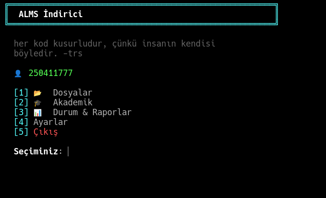

```
[1] Dosyalar
    ├── Yeni Dosyaları Senkronize Et
    ├── Dosya İndir (seçici)
    ├── Dersleri Listele
    ├── Bugünkü Program / Takvim
    ├── İndirme Klasörünü Aç
    └── Dışa Aktar

[2] Akademik
    ├── Sınav Takvimi
    ├── Notlar
    ├── Transkript & Not Ortalaması
    ├── Ders Programı
    ├── Devamsızlık
    ├── Duyurular
    ├── Zaman Çizelgesi (LMS)
    ├── Sınav Konuları
    └── Çevrimdışı Önbellek

[3] Durum & Raporlar
[4] Ayarlar
    ├── Ayarlar
    ├── Otomatik Çalıştırma
    └── Bildirim Otomasyonu
[5] Çıkış
```

---

### `alms setup` — Kurulum
```
alms setup
alms setup --reconfigure credentials   # Sadece şifre güncelle
alms setup --reconfigure schedule      # Sadece otomasyon saatini güncelle
```
İlk kurulumda kullanıcı adı, şifre ve ayarları yapılandırır.
Tekrar çalıştırıldığında yeniden yapılandırma seçenekleri sunar.

---

### `alms sync` — Senkronizasyon

<!-- ═══════════════════════════════════════════════════════════════
     FOTOĞRAF 2 — Sync progress bar ekran görüntüsü
     Çekilecek yer : alms sync çalışırken █████░░ bar görünürken
     Dosya         : assets/foto-2-tr.png
     ═══════════════════════════════════════════════════════════════ -->


```
alms sync                              # Yeni dosyaları indir
alms sync --course FIZ108              # Tek ders
alms sync --courses FIZ108,MAT106      # Birden fazla ders
alms sync -f pdf                       # Sadece PDF
alms sync -f video                     # Sadece video
alms sync --week 7                     # Sadece 7. hafta
alms sync --all                        # Tümünü indir (indirilenler dahil)
alms sync --force                      # --all ile aynı
alms sync --quiet                      # Sessiz mod (otomasyon/cron için)
alms sync -v                           # Ayrıntılı log
```

**Filtreler birleştirilebilir:**
```bash
alms sync --course FIZ108 -f pdf --week 3
```

---

### `alms download` — Dosya Seçici

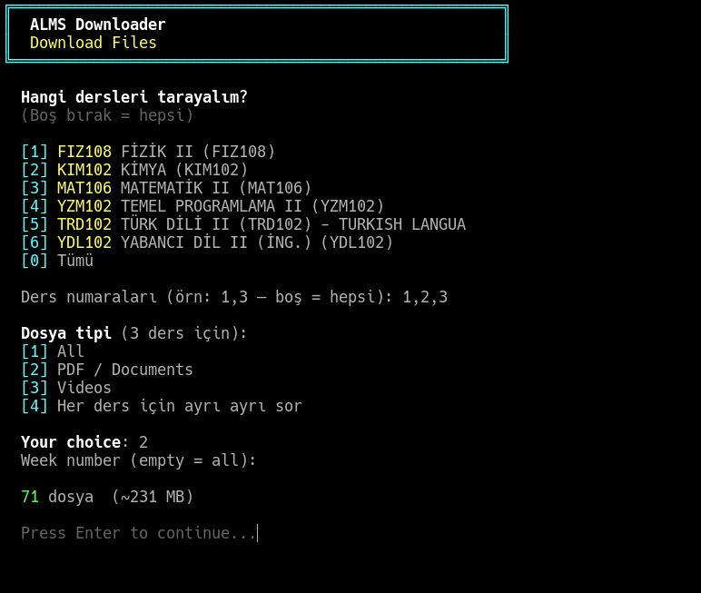

```
alms download
```
İnteraktif dosya seçim ekranı açar.

**Tuş Kısayolları:**

| Tuş | İşlev |
|-----|-------|
| `↑` `↓` | Hareket |
| `SPACE` | Seç / seçimi kaldır |
| `G` | Grubun tamamını seç |
| `A` | Hepsini seç |
| `N` | Seçimi temizle |
| `F` | Filtrele (ders kodu veya dosya adı) |
| `ESC` | Filtreyi temizle |
| `ENTER` | Onayla ve indir |
| `Q` | İptal |

**Dosya simgeleri:**

| Simge | Anlam |
|-------|-------|
| `●` | Seçili |
| `◉` | İndirilmiş (önceden) |
| `○` | Seçili değil |

---

### `alms list` — Ders Listesi

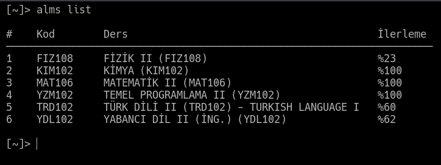

```
alms list
```
Aktif dersleri ve ilerleme yüzdelerini gösterir.

---

### `alms today` — Günlük Program

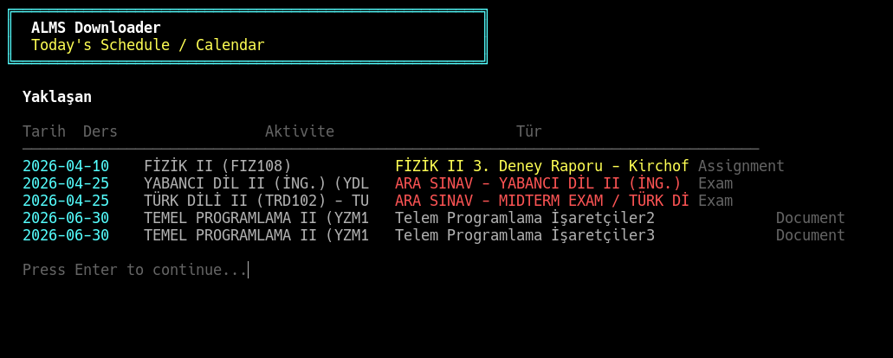

```
alms today
```
Bugünkü ve yaklaşan aktiviteleri (ödev, sınav) gösterir.

---

### `alms status` — Sistem Durumu

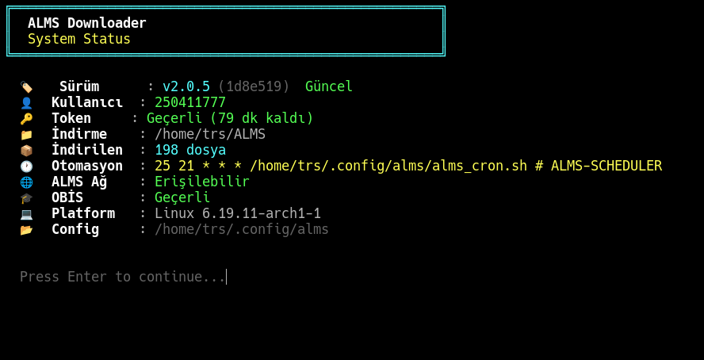

```
alms status
```
Aşağıdaki bilgileri gösterir:
- Uygulama sürümü ve build
- Güncelleme var mı
- ALMS token durumu (kaç dakika geçerli)
- İndirme klasörü ve dosya sayısı
- Otomasyon zamanlaması
- Ağ erişimi
- OBİS oturum durumu

---

### `alms open` — Klasörü Aç
```
alms open
```
İndirme klasörünü dosya yöneticisinde açar.

---

### `alms stats` — İstatistikler

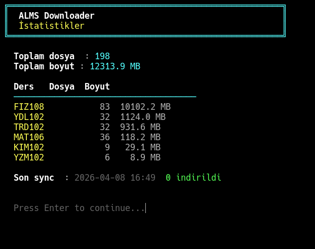

```
alms stats
```
Derse göre indirilen dosya sayısı ve boyutunu gösterir.

---

### `alms log` — Aktivite Logu

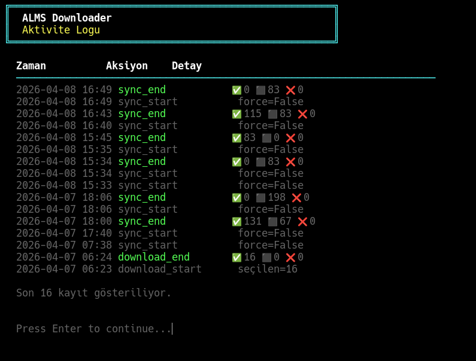

```
alms log
```
Son 30 sync/indirme işleminin kaydını gösterir.

---

### `alms export` — Dışa Aktar

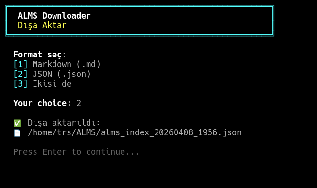

```
alms export
```
Ders listesini, indirilen dosyaların indexini **ve OBİS akademik verilerini** dışa aktarır.
Format seçimi: Markdown veya JSON.
Çıktı: `~/ALMS/alms_index_TARIH.md` veya `.json`

**Dışa aktarılan veriler:**
- Ders listesi ve dosya indexi
- Sınav tarihleri (önbellekte varsa)
- Ders notları (önbellekte varsa)
- Transkript (önbellekte varsa)
- Devamsızlık (önbellekte varsa)
- Ders programı (önbellekte varsa)

---

### `alms obis` — OBİS Entegrasyonu

<!-- ═══════════════════════════════════════════════════════════════
     FOTOĞRAF 3 — Sınav takvimi ekran görüntüsü
     Çekilecek yer : alms obis --sinav çıktısı (tarih + saat listesi)
     Dosya         : assets/foto-3-tr.png
     ═══════════════════════════════════════════════════════════════ -->
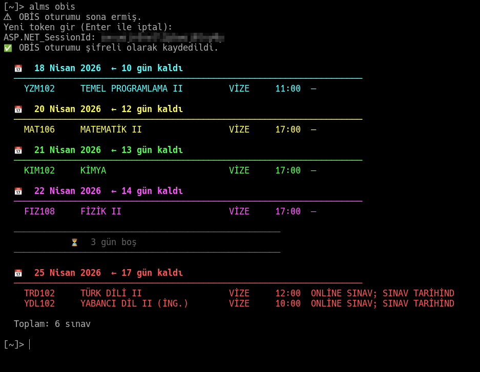

```
alms obis --setup              # OBİS oturumu kur (bir kez yapılır)
alms obis --setup --force      # Oturumu zorla yenile
alms obis sinav                # Sınav tarihleri (varsayılan)
alms obis notlar               # Ders notları: ödev/vize/final/harf
alms obis transkript           # Transkript + ANO ve GANO ortalaması
alms obis program              # Haftalık ders programı
alms obis devamsizlik          # Devamsızlık (limite yakınsa kırmızı uyarı)
alms obis duyurular            # OBİS duyuruları (tam içerik gösterir)
alms takvim                    # ALMS zaman çizelgesi (ödev, sınav)
alms duyurular                 # Duyurular kısayolu
alms transkript                # Transkript kısayolu
alms program                   # Ders programı kısayolu
alms devamsizlik               # Devamsızlık kısayolu
alms notlar                    # Notlar kısayolu
alms sinav                     # Sınav tarihleri kısayolu
```

**OBİS kurulumu:**
1. Tarayıcıda `obis.gelisim.edu.tr` adresine giriş yap
2. `F12` → `Storage` → `Cookies` → `obis.gelisim.edu.tr`
3. `ASP.NET_SessionId` değerini kopyala
4. `alms obis --setup` çalıştır, yapıştır

Token her format kabul edilir:
```
m1qijfitlaoatp0mddt2bmtd
ASP.NET_SessionId:"m1qijfitlaoatp0mddt2bmtd"
ASP.NET_SessionId=m1qijfitlaoatp0mddt2bmtd
```

Sınav takvimi örnek çıktı:
```
📅  18 Nisan 2026  ← 17 gün kaldı
──────────────────────────────────────────────────────────────────────
  YZM102     TEMEL PROGRAMLAMA II         VİZE     11:00

📅  20 Nisan 2026  ← 19 gün kaldı
──────────────────────────────────────────────────────────────────────
  MAT106     MATEMATİK II                 VİZE     17:00
```

---

### `alms cache` — Çevrimdışı Önbellek

<!-- ═══════════════════════════════════════════════════════════════
     FOTOĞRAF 5 — Önbellek durum ekranı
     Çekilecek yer : alms cache  (bazı veriler güncel, bazıları eski)
     Dosya         : assets/foto-5-tr.png
     ═══════════════════════════════════════════════════════════════ -->
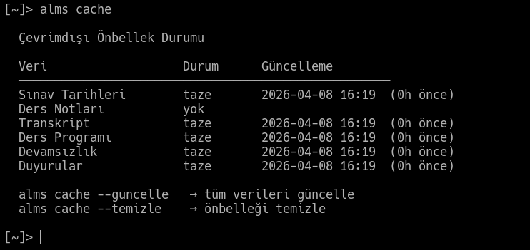

OBİS verilerini yerel diske kaydet; internet olmadan görüntüle.

```
alms cache                   # Önbellek durumunu göster
alms cache --guncelle        # Tüm OBİS verilerini çek ve kaydet
alms cache --temizle         # Önbelleği temizle
```

**Önbelleklenen veriler:**
- Sınav tarihleri
- Ders notları (ödev / vize / final / harf)
- Transkript & not ortalaması
- Haftalık ders programı
- Devamsızlık durumu
- Duyurular

**Kullanım senaryosu — sınav günü:**
```bash
# Dün akşam bağlantı varken:
alms cache --guncelle

# Sabah sınav salonunda (internet yok):
alms obis sinav        # ⚠  Önbellekten gösteriliyor — 2026-04-07 23:41
alms obis devamsizlik  # ⚠  Önbellekten gösteriliyor
```

> Bağlantı varsa OBİS ekranları her açıldığında önbellek otomatik güncellenir.
> Önbellek dosyaları: `~/.config/alms/cache/` (Linux/macOS) veya `%APPDATA%\alms\cache\` (Windows)

**Durum çıktısı örneği:**
```
  Çevrimdışı Önbellek Durumu

  Sınav Tarihleri     taze       2026-04-07 23:41  (8s önce)
  Ders Notları        taze       2026-04-07 23:41  (8s önce)
  Transkript          eski       2026-04-06 14:22  (33s önce)
  Ders Programı       taze       2026-04-07 23:41  (8s önce)
  Devamsızlık         taze       2026-04-07 23:41  (8s önce)
  Duyurular           —          yok
```

---

### `alms konular` — Sınav Konuları

<!-- ═══════════════════════════════════════════════════════════════
     FOTOĞRAF 4 — Sınav konuları listesi
     Çekilecek yer : alms konular  (birkaç konu girilmişken)
     Dosya         : assets/foto-4-tr.png
     ═══════════════════════════════════════════════════════════════ -->
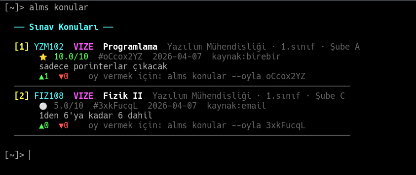

Firebase üzerinde öğrencilerin paylaştığı sınav konuları. `alms setup` ile OBİS girişi yapılmışsa Firebase **otomatik bağlanır** — ayrıca bir kurulum gerekmez.

```
alms konular                    # Tüm konuları listele
alms konular --ekle             # Yeni konu gir
alms konular --vize             # Sadece vize konuları
alms konular --final            # Sadece final konuları
alms konular --ders FIZ108      # Belirli ders konuları
alms konular --oyla <id>        # Konuya oy ver
alms konular --setup            # Firebase bağlantısını kur (geliştiriciye özel)
```

**Konu listesi örnek çıktı:**
```
  ── Sınav Konuları ──

  [1] FIZ108  VİZE  •  1-4. hafta konuları
      • Kinematik ve dinamik
      • Newton yasaları
      • Enerji ve iş
      👍 12  👎 1   ★★★★☆ Güvenilir  —  ID: a3f2c1
      oy vermek için: alms konular --oyla a3f2c1

  [2] MAT106  VİZE  •  Türev ve integral
      • Limit kavramı
      • Türev kuralları
      👍 8   👎 0   ★★★★★ Çok Güvenilir  —  ID: b7e9d4
```

**Yeni konu ekleme (`alms konular --ekle`):**
1. Sınav türü seçilir: Vize / Final / Quiz / Bütünleme
2. Fakülte seçilir (listeden veya manuel)
3. Bölüm seçilir
4. Sınıf ve şube girilir
5. Ders kodu ve adı girilir
6. Konular girilir (tek mesaj veya liste modunda)
7. Önizleme gösterilir, onaylanır

**Oylama:**
- Her öğrenci aynı konuya bir kez oy verebilir
- 👍 Doğru — bilgi güvenilir / 👎 Yanlış — bilgi hatalı
- Oy geri alınamaz, değiştirilemez

**Trust Score:**
| Skor | Anlam |
|------|-------|
| ★★★★★ | Çok Güvenilir |
| ★★★★☆ | Güvenilir |
| ★★★☆☆ | Orta |
| ★★☆☆☆ | Şüpheli |
| ★☆☆☆☆ | Güvenilmez |

> **Gizlilik:** Öğrenci numarası SHA-256 hash ile saklanır. Firebase'de gerçek numara görünmez.
> **Spam koruması:** Her öğrenci 30 dakikada bir konu ekleyebilir.

---

### `alms notify-check` — Bildirim Kontrolü

<!-- ═══════════════════════════════════════════════════════════════
     FOTOĞRAF 6 — Bildirim Otomasyonu ayar ekranı
     Çekilecek yer : alms  →  Ayarlar  →  Bildirim Otomasyonu
     Dosya         : assets/foto-6-tr.png
     ═══════════════════════════════════════════════════════════════ -->
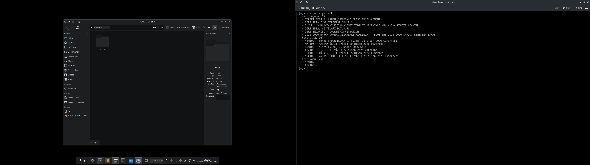

Yeni OBİS duyurusu, sınav veya sınav konusu eklendiğinde masaüstü bildirimi gönderir.

```
alms notify-check           # Durumu göster, yeni öğe varsa bildir
alms notify-check --quiet   # Sessiz kontrol — sadece bildirim gönderir (cron için)
```

**Otomatik zamanlama — menü üzerinden:**

`alms` → **[4] Ayarlar → Bildirim Otomasyonu**

- Etkinleştir → kontrol aralığı seçilir (örn: `1` saat)
- Devre Dışı Bırak → zamanlamayı kaldırır
- Görülen Öğeleri Sıfırla → tüm görülen öğeleri temizler (bir sonraki kontrolde hepsi yeniden bildirir)

| Platform | Yöntem | Log |
|----------|--------|-----|
| Linux | crontab (`0 */N * * *`) | `~/.config/alms/notify.log` |
| macOS | launchd | `~/Library/Application Support/alms/notify.log` |
| Windows | Task Scheduler | `%APPDATA%\alms\notify.log` |

**Neyi kontrol eder:**
- OBİS duyuruları (bağlantı varsa)
- OBİS sınav tarihleri (bağlantı varsa)
- Firebase sınav konuları (internet olmasa bile — ALMS'ten bağımsız)

> Daha önce görülen öğeler tekrar bildirilmez. Durum `~/.config/alms/notifier_state.json` dosyasında tutulur.

---

### `alms update` — Güncelleme

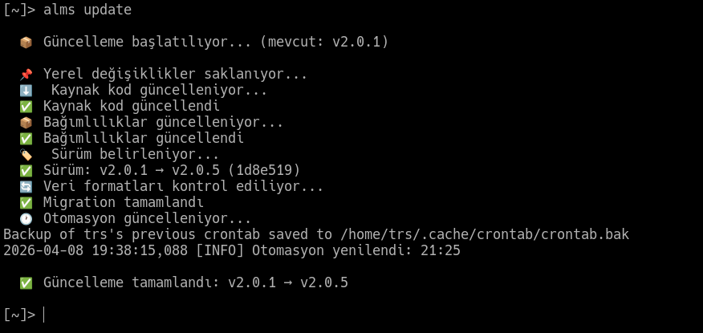

```
alms update
```
Güvenli güncelleme yapar:
1. Config dosyalarını yedekler
2. `git pull origin main`
3. Bağımlılıkları günceller
4. Sürüm bilgisini kaydeder
5. Otomasyonu yeniler
6. Hata olursa yedekten geri döner

---

### `alms --version` — Sürüm Bilgisi

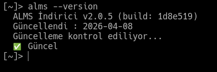

```
alms --version
```
Örnek çıktı:
```
  ALMS İndirici v2.0.0 (build: ea4674a)
  Güncellendi : 2026-04-05
  Değişiklik  : çapraz platform düzeltmeleri, otomatik kurulum
  Güncelleme kontrol ediliyor...
  ✅ Güncel
```
Güncelleme varsa:
```
  ⬆️  3 güncelleme mevcut → v2.1.0 — yüklemek için: alms update
```

---

### `alms logout` — Çıkış

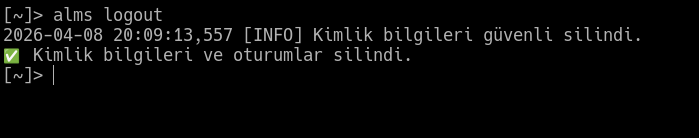

```
alms logout
```
Kayıtlı kimlik bilgilerini ve oturumları güvenli siler.
ALMS şifresi değiştirildiğinde kullanılır, ardından `alms setup` çalıştırılır.

---

### `alms config` — Ayar Görüntüle

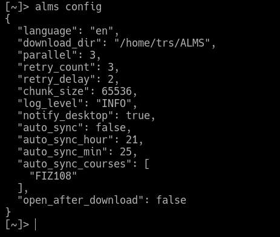

```
alms config
```
Mevcut ayarları JSON formatında gösterir (hassas bilgiler gizlenir).

---

## Otomatik İndirme

`alms` menüsünden **Ayarlar → Otomatik Çalıştırma** ile ayarlanır.

| Platform | Yöntem | Log |
|----------|--------|-----|
| Linux | crontab | `~/.config/alms/cron.log` |
| macOS | launchd | `~/Library/Application Support/alms/cron.log` |
| Windows | Task Scheduler | `%APPDATA%\alms\cron.log` |

**Otomatik çalışmada güncelleme kontrolü:**
Menü her açıldığında arka planda güncelleme kontrol edilir.
Güncelleme varsa menü görünmeden önce sorulur:
```
⬆️  3 güncelleme mevcut  v2.0.0 → v2.1.0
Şimdi güncellensin mi? [E/H]:
```

---

## Dosya Yapısı

```
~/ALMS/                                      # İndirme klasörü
├── FIZ108/
│   ├── Hafta_01/
│   └── Hafta_07/
└── YZM102/

~/.config/alms/                              # Config (Linux)
~/Library/Application Support/alms/         # Config (macOS)
%APPDATA%\alms\                              # Config (Windows)
├── credentials.enc              # Şifreli kimlik bilgileri
├── config.json                  # Ayarlar
├── manifest.json                # İndirilen dosya kaydı
├── version.json                 # Sürüm bilgisi
├── obis_session                 # Şifreli OBİS tokeni
├── alms.log                     # Uygulama logu
├── cron.log                     # Otomasyon logu
├── notify.log                   # Bildirim otomasyon logu
├── notifier_state.json          # Görülen bildirim kayıtları
└── cache/                       # Çevrimdışı önbellek
    ├── sinav.json
    ├── notlar.json
    ├── transkript.json
    ├── program.json
    ├── devamsizlik.json
    └── duyurular.json
```

---

## Güvenlik

| Özellik | Durum |
|---------|-------|
| Kimlik bilgileri şifreleme | AES-256 (Fernet), makineye özel |
| OBİS token şifreleme | AES-256 (Fernet) |
| SSL doğrulama | Her zaman açık |
| Log maskeleme | Token/şifre loga yazılmaz |
| Config izinleri | `chmod 700` (dizin), `chmod 600` (dosyalar) |
| Firebase gizlilik | Öğrenci no SHA-256 hash, gerçek numara görünmez |

---

## Sorun Giderme

**`alms` komutu tanınmıyor:**
```bash
# macOS (zsh)
source ~/.zprofile   # veya yeni terminal

# Linux (bash)
source ~/.bashrc

# Linux (zsh)
source ~/.zshrc

# Windows
# Yeni CMD veya PowerShell penceresi aç
```

**macOS — `alms` çalışıyor ama paket hatası (requests, cryptography):**
```bash
# Venv wrapper eksik olabilir, setup.sh yeniden çalıştırın:
./setup.sh
```

**macOS — kurulum sonrası lock dosyası kilitli:**
```bash
rm ~/Library/Application\ Support/alms/.alms.lock 2>/dev/null
```

**OBİS oturumu sona erdi:**
```bash
alms obis --setup
```

**Token süresi doldu:**
```bash
alms logout
alms setup
```

**Güncelleme başarısız:**
```bash
# Manuel güncelleme
cd /path/to/alms   # proje klasörü
git pull origin main
.venv/bin/python -m pip install -r requirements.txt
```

**Linux — bağımlılık eksik:**
```bash
.venv/bin/pip install -r requirements.txt
```

**Windows — bağımlılık eksik:**
```bat
.venv\Scripts\pip.exe install -r requirements.txt
```

**Önbellek bozuk veya eski:**
```bash
alms cache --temizle
alms cache --guncelle
```

**Sınav konuları yüklenmiyor (Firebase bağlantısı yok):**
```bash
# İnternet bağlantısını kontrol et
alms status

# Firebase yapılandırmasını kontrol et
alms konular --setup
```

**Bildirim otomasyonu çalışmıyor:**
```bash
# Manuel kontrol ile test et
alms notify-check

# Zamanlamayı yeniden kur
# alms  →  Ayarlar  →  Bildirim Otomasyonu  →  Etkinleştir
```
