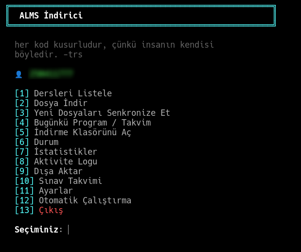

> 🇹🇷 **Türkçe** &nbsp;|&nbsp; 🇬🇧 [English](README.en.md)

---

# ALMS İndirici

IGU (İstanbul Gelişim Üniversitesi) ALMS ve OBİS sistemlerine tek komutla erişim.
Ders materyallerini otomatik indirir, sınav tarihlerini gösterir.

<!-- ═══════════════════════════════════════════════════════════════
     FOTOĞRAF 1 — Ana menü ekran görüntüsü
     Çekilecek yer : terminalde sadece  alms  komutunu çalıştırın
     Dosya         : assets/foto-1.png
     ═══════════════════════════════════════════════════════════════ -->


---

```
~/ALMS/
├── FIZ108/
│   ├── Hafta_01/  →  fizik_2_1_hafta.pdf
│   └── Hafta_07/  →  Fizik_2_Bolum_6.pdf
├── YZM102/
│   └── Hafta_04/  →  Pointers2.pdf
└── MAT106/
    └── Hafta_03/  →  mat_3_hafta.pdf
```

---

## Kurulum

### macOS

```bash
git clone https://github.com/trs-1342/alms
cd alms
chmod +x setup.sh && ./setup.sh
alms setup
```

> `setup.sh` eksik araçları otomatik kurar:
> - **Homebrew** yoksa → kurulur
> - **Python 3.10+** yoksa → `brew install python3`
> - **git** yoksa → `brew install git`
>
> Yönetici şifresi **gerekmez** (Homebrew kullanıcı düzeyinde çalışır).

### Linux

```bash
git clone https://github.com/trs-1342/alms
cd alms
chmod +x setup.sh && ./setup.sh
alms setup
```

> `setup.sh` eksik araçları otomatik kurar (sudo gerekir):
> - **Python 3.10+** yoksa → `pacman`/`apt`/`dnf` ile kurulur
> - **git** yoksa → paket yöneticisi ile kurulur
> - **cronie/cron** yoksa → otomatik indirme için kurulur ve başlatılır
>
> Sudo şifresi istenirse girin; atlamak için `Ctrl+C` sonra `Enter`.

### Windows

```bat
git clone https://github.com/trs-1342/alms
cd alms
setup.bat
alms setup
```

> `setup.bat` eksik araçları otomatik kurar:
> - **Python 3.10+** yoksa → `winget install Python.Python.3.12`
>
> **Otomatik indirme (Task Scheduler) için yönetici izni gereklidir.**
> Sağ tık → "Yönetici olarak çalıştır" ile açın.

---

### Manuel Kurulum

Otomatik kurulum çalışmazsa adım adım uygulayın.

#### macOS — Manuel

```bash
# 1. Homebrew kur
/bin/bash -c "$(curl -fsSL https://raw.githubusercontent.com/Homebrew/install/HEAD/install.sh)"

# Apple Silicon (M1/M2/M3) için PATH:
echo 'eval "$(/opt/homebrew/bin/brew shellenv)"' >> ~/.zprofile
eval "$(/opt/homebrew/bin/brew shellenv)"

# 2. Araçları kur
brew install python3 git

# 3. Projeyi klonla
git clone https://github.com/trs-1342/alms
cd alms

# 4. Sanal ortam ve paketler
python3 -m venv .venv
source .venv/bin/activate
python3 -m pip install --upgrade pip
pip install -r requirements.txt

# 5. alms komutu oluştur
mkdir -p ~/.local/bin
echo '#!/usr/bin/env bash' > ~/.local/bin/alms
echo "exec \"$(pwd)/.venv/bin/python\" \"$(pwd)/alms.py\" \"\$@\"" >> ~/.local/bin/alms
chmod +x ~/.local/bin/alms

# 6. PATH'e ekle (zsh için)
echo 'export PATH="$HOME/.local/bin:$PATH"' >> ~/.zprofile
source ~/.zprofile

# 7. İlk kurulum
alms setup
```

#### Linux — Manuel

```bash
# 1. Araçları kur (Arch örneği; apt/dnf için uyarlayın)
sudo pacman -S python git cronie
sudo systemctl enable --now cronie

# 2. Projeyi klonla
git clone https://github.com/trs-1342/alms
cd alms

# 3. Sanal ortam ve paketler
python3 -m venv .venv
source .venv/bin/activate
pip install --upgrade pip
pip install -r requirements.txt

# 4. alms komutu oluştur
mkdir -p ~/.local/bin
echo '#!/usr/bin/env bash' > ~/.local/bin/alms
echo "exec \"$(pwd)/.venv/bin/python\" \"$(pwd)/alms.py\" \"\$@\"" >> ~/.local/bin/alms
chmod +x ~/.local/bin/alms

# 5. PATH
echo 'export PATH="$HOME/.local/bin:$PATH"' >> ~/.bashrc
source ~/.bashrc

# 6. İlk kurulum
alms setup
```

#### Windows — Manuel

```bat
:: 1. Python kur (winget)
winget install Python.Python.3.12 --accept-package-agreements

:: 2. Git kur (yoksa)
winget install Git.Git --accept-package-agreements

:: Yeni terminal aç, ardından:

:: 3. Projeyi klonla
git clone https://github.com/trs-1342/alms
cd alms

:: 4. Sanal ortam ve paketler
python -m venv .venv
.venv\Scripts\python.exe -m pip install --upgrade pip
.venv\Scripts\pip.exe install -r requirements.txt

:: 5. alms.bat oluştur
echo @echo off > alms.bat
echo "%CD%\.venv\Scripts\python.exe" "%CD%\alms.py" %%* >> alms.bat

:: 6. İlk kurulum
alms.bat setup
```

---

## Temel Kullanım

```bash
alms                # Menü
alms sync           # Yeni dosyaları indir
alms download       # Dosya seçerek indir
alms obis --sinav   # Sınav takvimi
alms update         # Güncelleme yükle
alms --version      # Sürüm + güncelleme kontrolü
```

Tam kullanım rehberi: **[KULLANIM.md](KULLANIM.md)**

---

## Komut Özeti

| Komut | Açıklama |
|-------|----------|
| `alms` | İnteraktif menü |
| `alms setup` | İlk kurulum |
| `alms sync` | Yeni dosyaları indir |
| `alms sync --courses FIZ108,MAT106` | Belirli dersleri indir |
| `alms sync -f pdf` | Sadece PDF |
| `alms sync --quiet` | Sessiz mod (otomasyon) |
| `alms download` | Dosya seçici |
| `alms list` | Dersleri listele |
| `alms today` | Yaklaşan aktiviteler |
| `alms status` | Sistem durumu |
| `alms stats` | İstatistikler |
| `alms log` | Aktivite logu |
| `alms export` | Ders indexini dışa aktar |
| `alms open` | İndirme klasörünü aç |
| `alms obis --setup` | OBİS oturumu kur |
| `alms obis --sinav` | Sınav takvimi |
| `alms obis notlar` | Ders notları |
| `alms obis devamsizlik` | Devamsızlık |
| `alms update` | Güncelleme yükle |
| `alms --version` | Sürüm bilgisi |
| `alms logout` | Kimlik bilgilerini sil |

---

## OBİS Kurulumu

Tarayıcıda OBİS'e giriş yaptıktan sonra **bir kez** yapılır:

```bash
alms obis --setup
# F12 → Storage → Cookies → ASP.NET_SessionId değerini kopyala yapıştır
```

Oturum kapatılmadığı sürece token geçerli kalır.

---

## Otomatik İndirme

Menüden **[12] Otomatik Çalıştırma** ile ayarlanır.

| Platform | Yöntem | Log |
|----------|--------|-----|
| Linux | crontab | `~/.config/alms/cron.log` |
| macOS | launchd | `~/Library/Application Support/alms/cron.log` |
| Windows | Task Scheduler | `%APPDATA%\alms\cron.log` |

---

## Güvenlik

- Kimlik bilgileri **AES-256** ile şifrelenir, makineye özel
- OBİS token şifreli saklanır
- SSL doğrulama her zaman açık
- Token/şifre log dosyasına yazılmaz

---

## Güncelleme Sistemi

```bash
alms update
```

- Config dosyaları yedeklenir
- `git pull` + bağımlılık güncellemesi
- Hata durumunda otomatik rollback
- Menü açılışında güncelleme varsa bildirim gösterilir

Versiyon tag ile (`v2.0`) veya commit sayısından otomatik belirlenir.

---

## Bağımlılıklar

```
requests>=2.31.0,<3.0.0
cryptography>=42.0.0,<45.0.0
beautifulsoup4>=4.12.0,<5.0.0
```

`setup.sh` / `setup.bat` otomatik kurar.

---

## Lisans

MIT

## Geliştirici

[My Web Site](https://hattab.vercel.app)
[GitHub](https://github.com/trs-1342)
